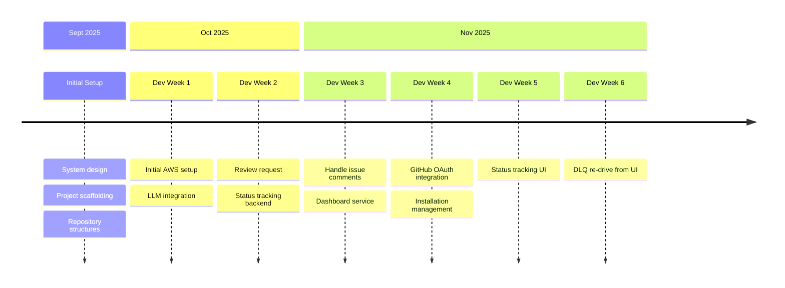

# TGRAFY (v0.1.0)

### Introduction
**TGRAFY** is an AI assistant for reviewing your code and addressing developer comments, with an aim to speed up the process and reduce release timelines. In its current state, TGRAFY supports reviewing pull requests and having a two-way conversation with the PR contributors in the discussions tab. It will review your code for the below parameters:

<ul>
  <li>Performance Bottlenecks</li>
  <li>Security practices</li>
  <li>Code quality</li>
</ul>

### Installation
[TGRAFY](https://example.com) is installable as a GitHub app. You need to follow the [setup](https://example.com) and [usage](https://example.com) guides, to get the most out of it. 

### What powers TGRAFY?
Our little helper is powered by a decoupled AWS-native application, that leverages a serverless design for resource and cost optimization.

**1. High-level System Design (HLSD)**

**2. Walkthrough & Rationale**

When installed, TGRAFY subscribes to the below events in the repository:

<ul>
  <li>Discussion comment</li>
  <li>Issue comment</li>
  <li>Pull request</li>
  <li>Pull request review</li>
  <li>Pull request review comment</li>
</ul>

The subscription events are received via GitHub's webhook call to TGRAFY, which is handled by an AWS Lambda function. Since these webhook calls are configured with a 10-second timeout, it is not feasible for a single Lambda to handle the end-to-end review process. The webhook handler returns an initial response (a greeting comment in case of reviewer assignment) and pushes the event to a task queue, which is implemented using a standard SQS queue.

The SQS message triggers a review handler Lambda, which is responsible for prompting the LLM (Claude Sonnet 3.5 in the current state) with the repository context, and publish the review to the PR discussion thread.

## Project Milestones & Roadmap

### Source Code
TGRAFY's source code is distributed accross the following repositories:

- Webhook Handler: *[webhook-handler-lambda](https://github.com/agulati02/webhook-handler-lambda)*
- Review Handler: *[review-handler-lambda](https://github.com/agulati02/review-handler-lambda)*
- Dashboard Service: *[tgrafy-dashboard-service](https://example.com)*
- Common Backend Utilities: *[tgrafy-commons](https://github.com/agulati02/tgrafy-commons)*
- Dashboard UI: *[tgrafy-dashboard-frontend](https://example.com)*

 

🖋️ **Author:** Anurag Gulati [🔗](https://github.com/agulati02)

